<div align="center">


# Career Mentor

### AI mock interviews built from your resume, graded by open-source AI that runs on your own machine

[](https://career-mentor-6ctn.onrender.com/)
[](https://drive.google.com/file/d/REPLACE_WITH_PROJECT_REPORT_ID/view)
[](docs/SAMPLE_REPORTS.md)


</div>

<p align="center">
  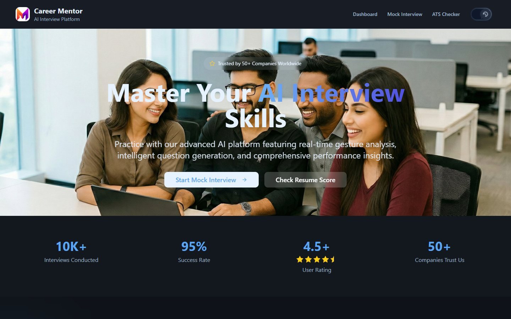
</p>

---

## Table of Contents

- [About](#about)
- [Why I Built This](#why-i-built-this)
- [Features](#features)
- [Screenshots](#screenshots)
- [Sample Reports](#sample-reports)
- [How It Works](#how-it-works)
- [Tech Stack](#tech-stack)
- [Folder Structure](#folder-structure)
- [Getting Started](#getting-started)
- [Configuration](#configuration)
- [API Reference](#api-reference)
- [The AI Model: Choice and Fine-tuning](#the-ai-model-choice-and-fine-tuning)
- [Deployment](#deployment)
- [What's New in Version 2](#whats-new-in-version-2)
- [Roadmap](#roadmap)
- [Author](#author)
- [License](#license)

---

## About

**Career Mentor** is a full-stack mock interview platform for students and early-career engineers.

1. You upload your resume.
2. The AI interviewer reads your **actual projects and skills** and asks **five questions** about them: three conceptual questions and two coding problems.
3. You answer by **speaking**, **typing** or **writing code** in a built-in editor, while your **webcam** tracks eye contact, posture and tab switches, like a proctored round.
4. You get **two detailed PDF reports**: an interview assessment with a score, feedback and a model answer for every question, and an activity report of your on-camera behaviour.

A separate **ATS Resume Checker** scores your resume against a job description, lists the keywords you're missing and rewrites your weakest bullet points.

All AI runs on **open-source models on your own machine** through [Ollama](https://ollama.com). There are no paid APIs, no API keys and no accounts, and your resume is never sent to a third-party AI service.

🔗 **Live demo:** https://career-mentor-6ctn.onrender.com/

> [!IMPORTANT]
> The live demo hosts the **frontend**. The AI backend needs Ollama and around 8 GB RAM, so it runs on a local machine. To try the full interview flow, run the backend locally (see [Getting Started](#getting-started)) and set **Dashboard → Local AI status → Backend address** to `http://127.0.0.1:8000`.

---

## Why I Built This

I kept losing interviews I was technically ready for.

I had the skills and the projects, but I didn't know what interviewers were really looking for, and I never got to practise explaining *my own* work out loud before it mattered. Generic question banks asked about things that weren't on my resume. Paid mock-interview platforms were expensive, and none of them told me *why* an answer was weak or what a strong answer would have sounded like.

What was missing was **a safe place to fail first**: somewhere to practise, get honest feedback straight away, and improve before the real round.

Career Mentor is that place. It asks about the projects **you** built, grades answers the way a real interviewer would, shows you a model answer, and tells you how you came across on camera. I rebuilt it in version 2 around **open-source AI running locally**, so any student can use it for free, without API limits and without handing their resume to a third party.

> *"We believe that everyone deserves a chance to land their dream job. This platform is my contribution to that belief."*

🎥 The full story is on the in-app [Founder Vlog](https://career-mentor-6ctn.onrender.com/vlog).

---

## Features

### 🎯 Mock interview built from your resume
- Parses **PDF and Word (.docx)** resumes, including two-column layouts and icon fonts.
- Generates **3 conceptual + 2 coding questions** that name your actual projects and technologies.
- Answer by **voice** (transcribed locally by Whisper), **text**, or **code** in a Monaco editor (Python, C++, Java, JavaScript), with optional code execution through Judge0.
- Questions can be **read aloud**, revisited and re-answered.
- **No waiting between questions:** answers are transcribed and graded in a background queue while you continue.

### 📊 Rubric-based grading with model answers
- Every answer is scored against a fixed rubric (conceptual and coding rubrics differ).
- Feedback includes *what worked*, *what was missing*, *how to improve* and **a strong model answer**.
- A **final assessment** gives an overall score, a verdict (Strong Hire / Hire / Borderline / Not Yet Ready), communication and problem-solving ratings, and next steps.

### 🎥 Real-time activity monitoring
- The browser sends a webcam frame every 2.5 s; the backend analyses it with **MediaPipe**.
- Tracks **eye contact, posture, face in frame, multiple people and hand movement**, calibrated to your own baseline.
- Logs **tab switches**: two warnings, and the third switch ends the interview.
- A live status panel shows *Face / Gaze / Posture* during the interview.

### 📄 ATS Resume Checker
- **Deterministic scoring**: the same resume always gets the same score, across Keywords, Impact, Structure and Skills.
- Paste a **job description** to see matched and missing keywords.
- Checks contact details, standard section headings, quantified bullets, action verbs, vague phrases and length.
- The LLM adds a recruiter-style summary, prioritised fixes and **before/after bullet rewrites**. It never invents numbers; it uses `[X%]` placeholders instead.

### 📈 Dashboard
- Score trend chart, interview history with report downloads, resume-check history.
- "Focus next" areas collected from your recent reports.
- **Local AI status** panel showing whether the LLM, Whisper and MediaPipe are ready, plus a configurable backend address.

### 🔒 Private and free
- Open-source LLM through Ollama; **no API keys, no usage limits**.
- **No sign-up**: history is tied to an anonymous ID stored in your browser.
- Every model call is logged locally so the model can be **fine-tuned on your own data**.

---

## Screenshots

### Landing page

| Why choose Career Mentor | Founder vlog |
| --- | --- |
| 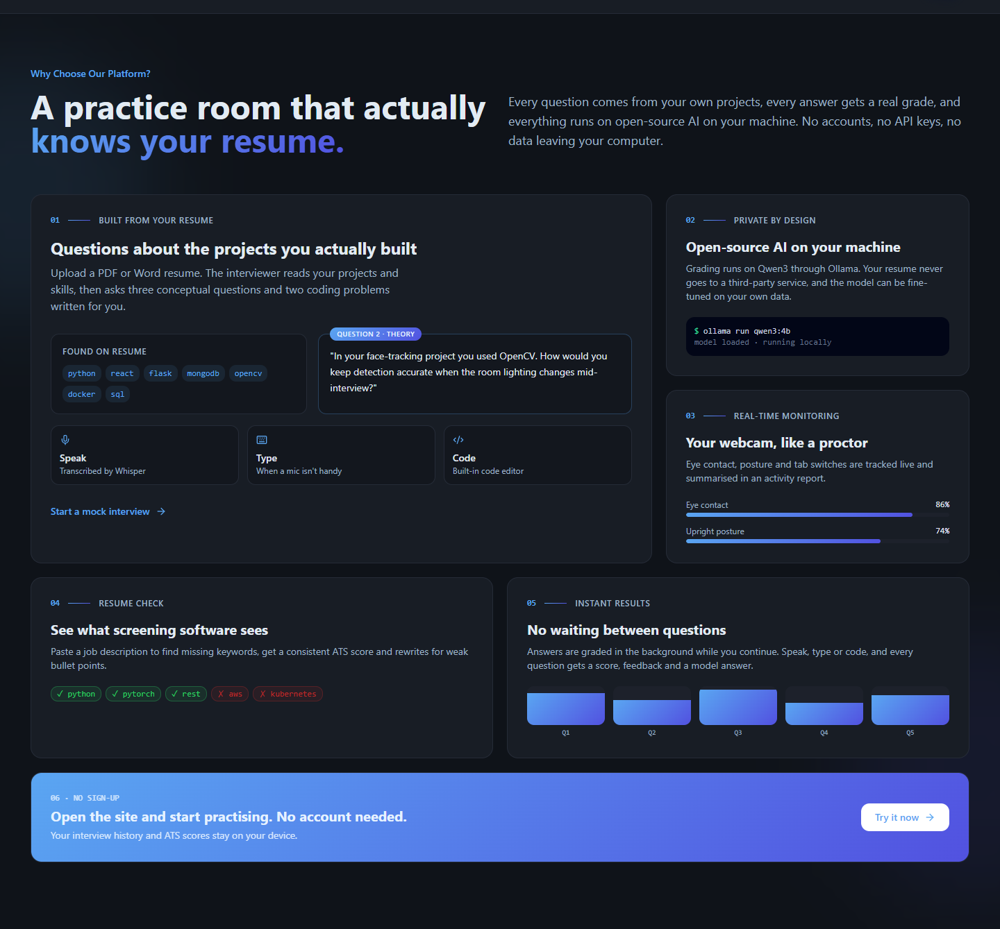 | 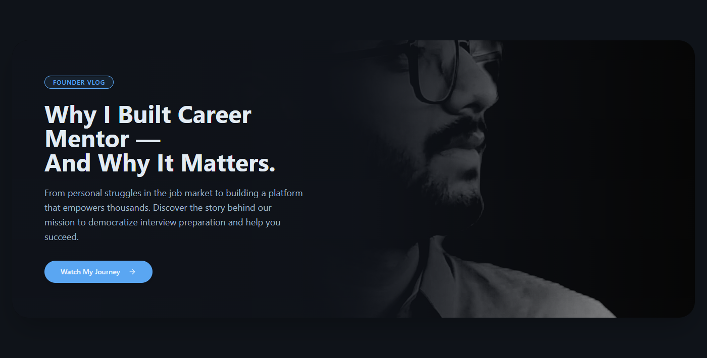 |

<p align="center">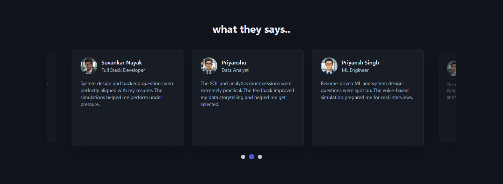</p>

### Dashboard

<p align="center">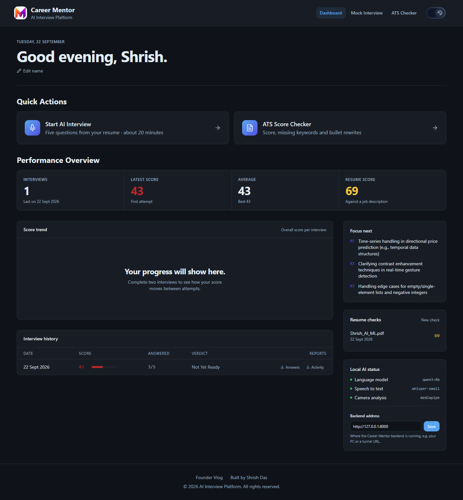</p>

*Performance overview, "Focus next" areas taken from the last report, interview history with PDF downloads, and the Local AI status panel (Qwen3-4B, Whisper, MediaPipe).*

### Mock interview flow

| 1. Upload resume | 2. Camera & microphone check |
| --- | --- |
| 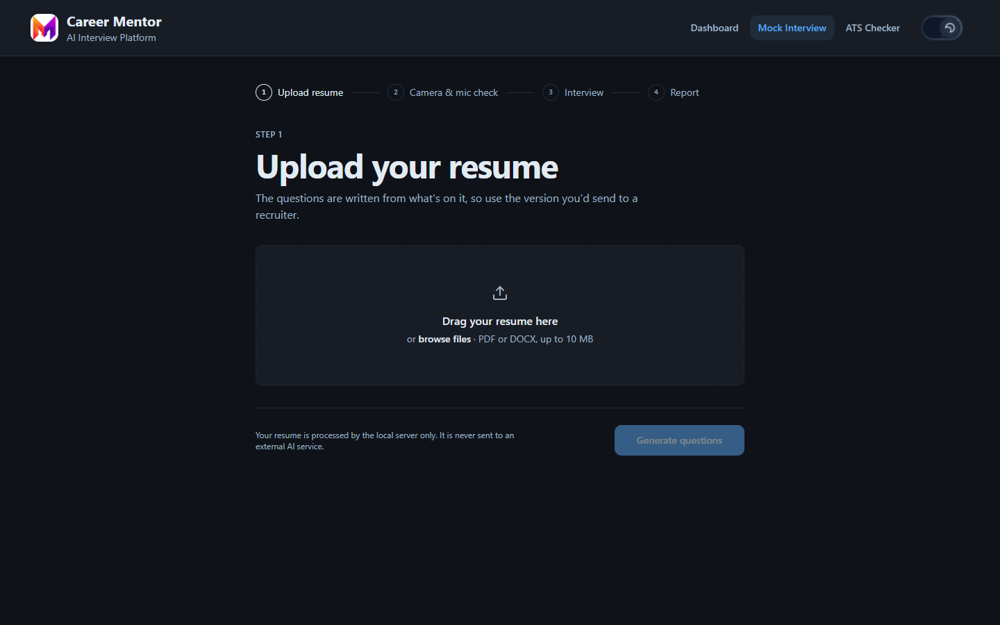 | 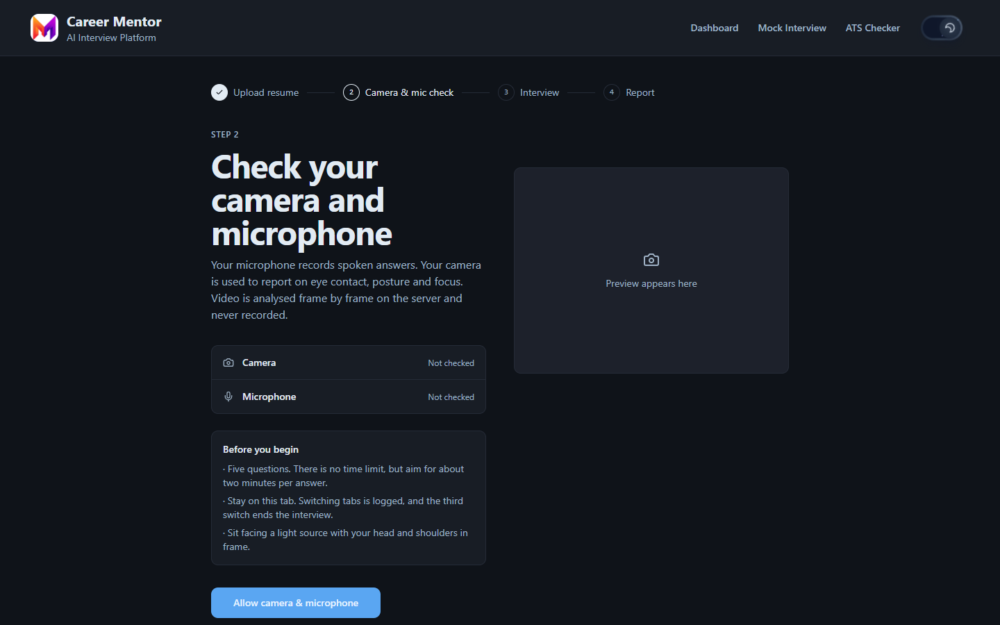 |

| 3a. Conceptual question (typed or spoken) | 3b. Coding question (Monaco editor) |
| --- | --- |
| 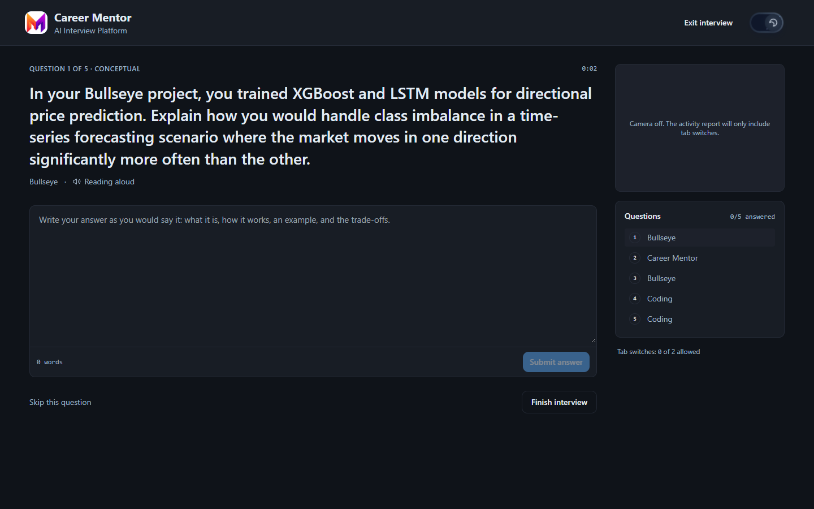 | 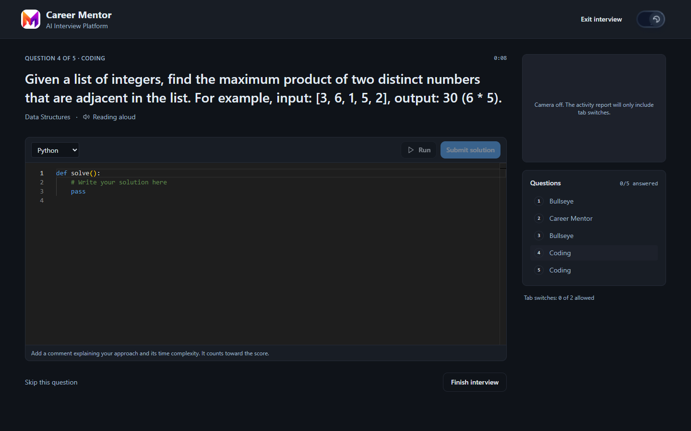 |

### Interview results

<p align="center">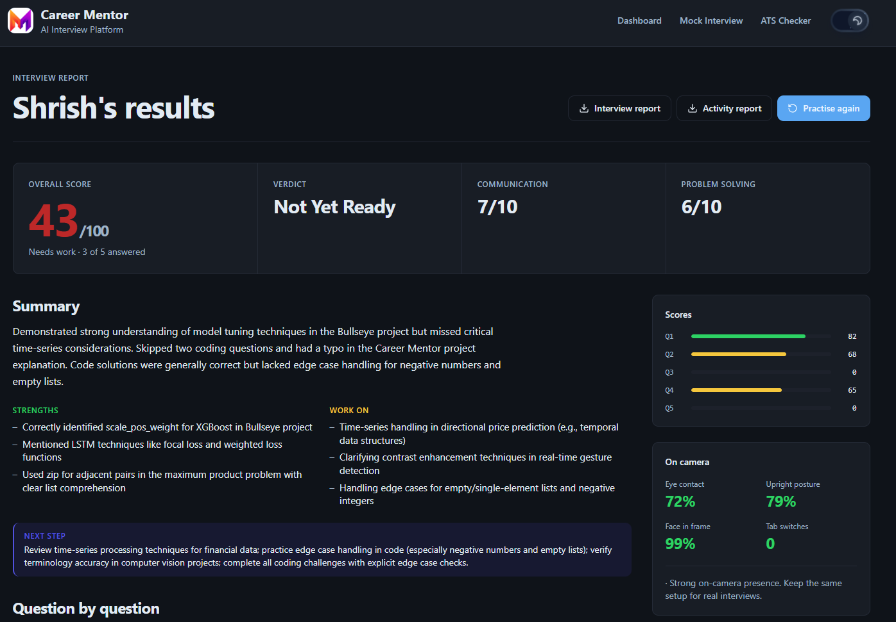</p>

*Overall score (43/100), verdict, communication and problem-solving ratings, an AI-written summary, strengths, areas to work on, a next step, per-question scores and on-camera metrics (72% eye contact, 79% upright posture, 0 tab switches).*

| Question-by-question feedback | All questions with scores |
| --- | --- |
| 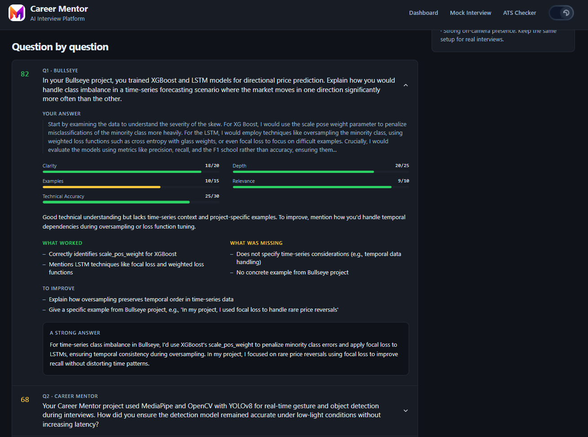 | 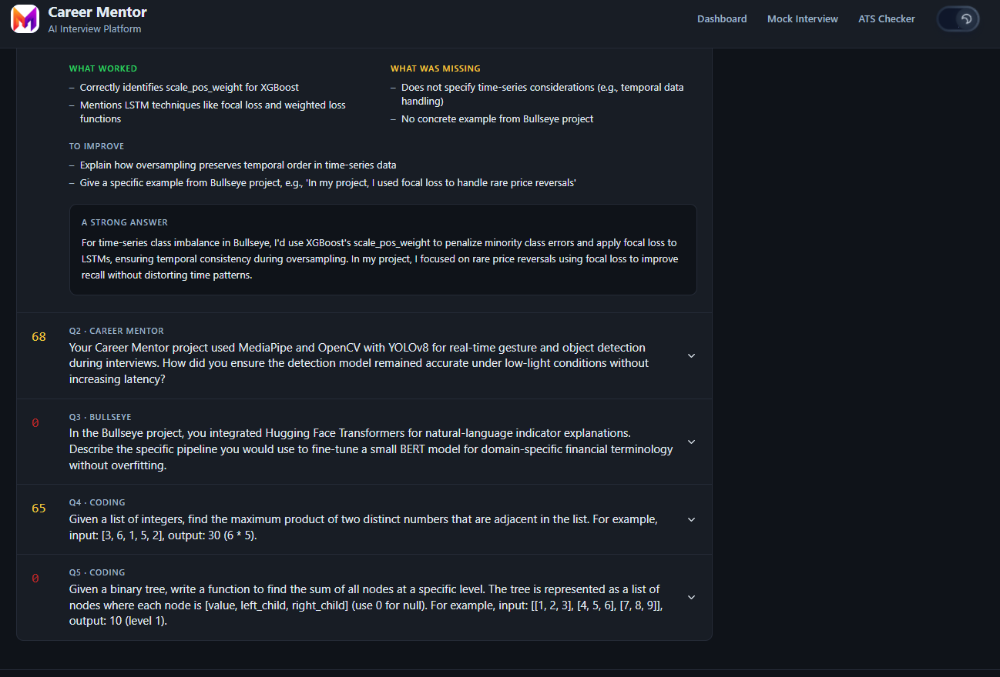 |

*Each answer shows the transcript, rubric breakdown (clarity, depth, examples, relevance, technical accuracy), feedback, what worked, what was missing, how to improve and a strong model answer.*

### ATS Resume Checker

<p align="center">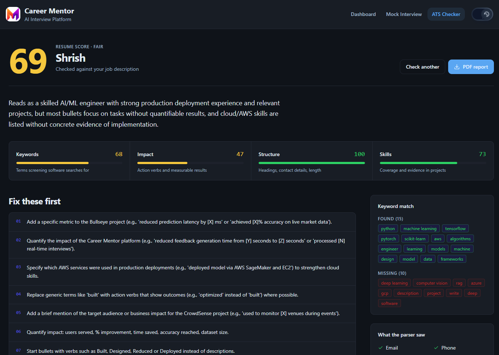</p>

*A resume scored 69/100 against a job description: section scores, an AI summary, prioritised fixes and keyword match (15 found, 10 missing).*

<p align="center">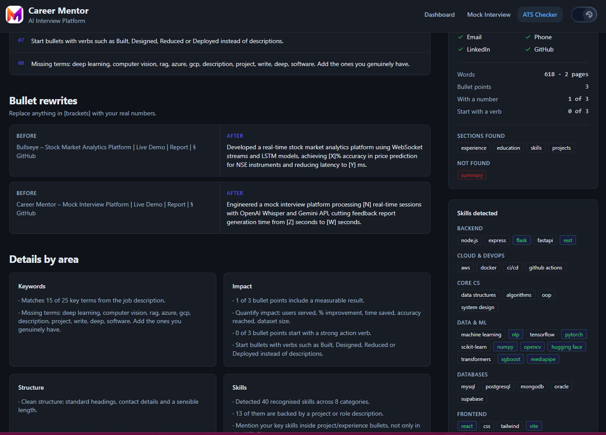</p>

*Before/after bullet rewrites with `[X]` placeholders for real numbers, detailed feedback by area, what the parser saw (contact details, word count, bullets) and detected skills grouped by category. Green skills are backed by a project description.*

---

## Sample Reports

Every interview produces two downloadable PDFs:

| Report | What it contains | Sample |
| --- | --- | --- |
| **Interview Assessment** | Overall score, verdict, summary, score chart, strengths and focus areas, and a full question-by-question breakdown with model answers | [📄 View](docs/SAMPLE_REPORTS.md#1-interview-assessment-report) |
| **Activity Report** | Eye contact, posture, face visibility, tab-switch log, observations, tips and evidence frames | [📄 View](docs/SAMPLE_REPORTS.md#2-activity-camera--focus-report) |
| ATS Resume Report *(bonus)* | Section scores, priority fixes, bullet rewrites, parsed resume data | [📄 View](docs/SAMPLE_REPORTS.md#3-ats-resume-report-bonus) |

➡️ **All sample reports, and what each section means: [docs/SAMPLE_REPORTS.md](docs/SAMPLE_REPORTS.md)**

---

## How It Works

### Architecture

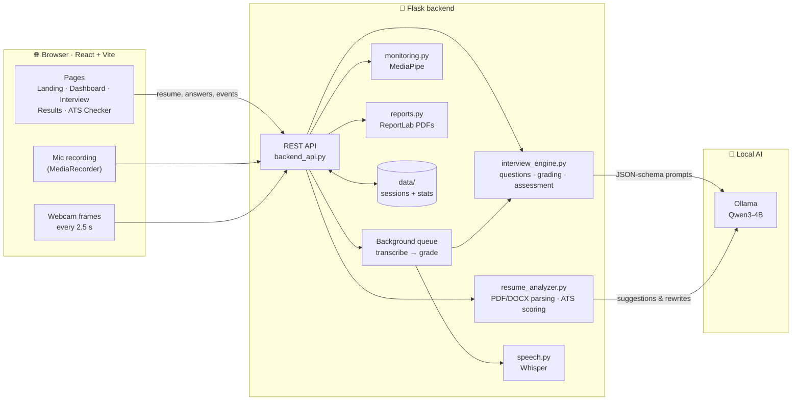
```mermaid
flowchart LR
    subgraph Browser["🌐 Browser · React + Vite"]
        UI["Pages<br/>Landing · Dashboard · Interview<br/>Results · ATS Checker"]
        CAM["Webcam frames<br/>every 2.5 s"]
        MIC["Mic recording<br/>(MediaRecorder)"]
    end

    subgraph Backend["🐍 Flask backend"]
        API["REST API<br/>backend_api.py"]
        RA["resume_analyzer.py<br/>PDF/DOCX parsing · ATS scoring"]
        IE["interview_engine.py<br/>questions · grading · assessment"]
        Q["Background queue<br/>transcribe → grade"]
        SP["speech.py<br/>Whisper"]
        MON["monitoring.py<br/>MediaPipe"]
        REP["reports.py<br/>ReportLab PDFs"]
        STORE[("data/<br/>sessions + stats")]
    end

    subgraph Local["🧠 Local AI"]
        OLL["Ollama<br/>Qwen3-4B"]
    end

    UI -- "resume, answers, events" --> API
    MIC --> API
    CAM --> API
    API --> RA
    API --> IE
    API --> Q
    Q --> SP
    Q --> IE
    API --> MON
    API --> REP
    API <--> STORE
    IE -- "JSON-schema prompts" --> OLL
    RA -- "suggestions & rewrites" --> OLL
```

### Interview workflow

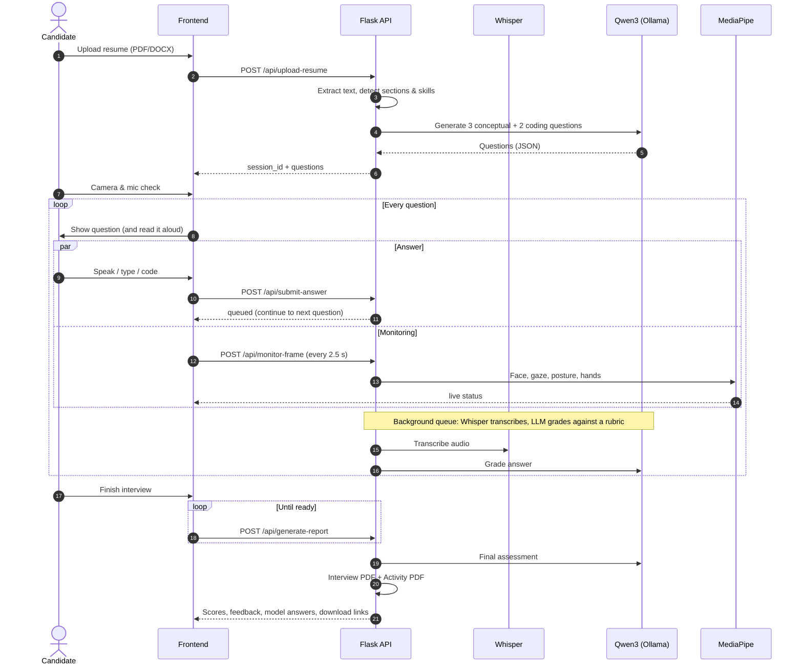
```mermaid
sequenceDiagram
    autonumber
    actor U as Candidate
    participant F as Frontend
    participant B as Flask API
    participant W as Whisper
    participant L as Qwen3 (Ollama)
    participant M as MediaPipe

    U->>F: Upload resume (PDF/DOCX)
    F->>B: POST /api/upload-resume
    B->>B: Extract text, detect sections & skills
    B->>L: Generate 3 conceptual + 2 coding questions
    L-->>B: Questions (JSON)
    B-->>F: session_id + questions

    U->>F: Camera & mic check
    loop Every question
        F->>U: Show question (and read it aloud)
        par Answer
            U->>F: Speak / type / code
            F->>B: POST /api/submit-answer
            B-->>F: queued (continue to next question)
        and Monitoring
            F->>B: POST /api/monitor-frame (every 2.5 s)
            B->>M: Face, gaze, posture, hands
            M-->>F: live status
        end
        Note over B,L: Background queue: Whisper transcribes, LLM grades against a rubric
        B->>W: Transcribe audio
        B->>L: Grade answer
    end

    U->>F: Finish interview
    loop Until ready
        F->>B: POST /api/generate-report
    end
    B->>L: Final assessment
    B->>B: Interview PDF + Activity PDF
    B-->>F: Scores, feedback, model answers, download links
```

### How grading stays reliable on a small model

- **Structured output:** every LLM call uses Ollama's JSON-schema `format`, so responses always parse.
- **Few-shot examples:** the grader sees a worked example of a real grade, which stops small models echoing an empty template.
- **Consistent scores:** the overall score is the sum of rubric categories, never a separate guess.
- **Guards:** empty or placeholder responses are detected and retried; skipped or blank answers are scored 0 without calling the model; invented numbers in resume rewrites are replaced with `[X]`.
- **Fallbacks everywhere:** if Ollama is offline, questions come from a built-in bank and grading falls back to an estimate, so an interview always finishes.

---

## Tech Stack

| Layer | Technology | Purpose |
| --- | --- | --- |
| **Frontend** | React 18, TypeScript 5, Vite 5 | SPA and build tooling |
| | Tailwind CSS 3, shadcn/ui (Radix), Framer Motion | Styling, accessible components, animation |
| | TanStack Query 5, React Router 6 | Data fetching and caching, routing |
| | Monaco Editor, Recharts, react-dropzone | Code editor, charts, file upload |
| **Backend** | Python 3.11, Flask 3, Flask-CORS | REST API |
| **LLM** | [Ollama](https://ollama.com) + **Qwen3-4B** (any Ollama model works) | Question generation, grading, assessments, resume suggestions |
| **Speech-to-text** | OpenAI Whisper (`small`, runs locally) + ffmpeg | Transcribing spoken answers |
| **Computer vision** | MediaPipe 0.10 (Face Mesh, Pose, Hands), OpenCV | Activity monitoring |
| **Documents** | PyMuPDF, ReportLab, Matplotlib | Resume parsing, PDF reports, charts |
| **Code execution** | Judge0 (RapidAPI, optional) | "Run" button in the code editor |
| **Fine-tuning** | Unsloth, TRL (QLoRA), GGUF | Training the model on your own interview data |
| **Hosting** | Render (static site), Docker | Frontend hosting, backend container |

---

## Folder Structure

```
Career_MentorV2/
├── Backend/                         # Flask API + AI pipeline
│   ├── backend_api.py               # Routes, session store, background grading queue, local stats
│   ├── llm.py                       # Ollama client: JSON-schema output, retries, interaction logging
│   ├── interview_engine.py          # Question generation, rubric grading, final assessment (+ fallbacks)
│   ├── resume_analyzer.py           # PDF/DOCX extraction, section & skill detection, ATS scoring
│   ├── monitoring.py                # Webcam frame analysis: gaze, posture, faces, hands
│   ├── speech.py                    # Whisper speech-to-text
│   ├── reports.py                   # Interview, activity and ATS PDF reports
│   ├── requirements.txt
│   ├── Dockerfile
│   ├── .env.example                 # Backend configuration template
│   ├── run backend.txt              # Quick start commands
│   └── uploads/                     # Uploaded resumes (git-ignored)
│
├── Frontend/                        # React + TypeScript + Vite app
│   ├── public/                      # favicon, testimonial avatars
│   ├── src/
│   │   ├── pages/
│   │   │   ├── Index.tsx            # Landing page
│   │   │   ├── Dashboard.tsx        # Stats, trend, history, local AI status
│   │   │   ├── ResumeUpload.tsx     # Step 1: upload resume
│   │   │   ├── GrantPermissions.tsx # Step 2: camera & mic check
│   │   │   ├── Interview.tsx        # Step 3: interview (voice / text / code + monitoring)
│   │   │   ├── InterviewResults.tsx # Step 4: results & downloads
│   │   │   ├── ATSChecker.tsx       # Resume checker
│   │   │   ├── Vlog.tsx             # Founder vlog
│   │   │   └── NotFound.tsx
│   │   ├── components/
│   │   │   ├── Header.tsx           # Header, navigation, footer
│   │   │   ├── WhyChoose.tsx        # "Why Choose Our Platform?" section
│   │   │   ├── DarkModeToggle.tsx
│   │   │   ├── ThemeContext.tsx
│   │   │   ├── ErrorBoundary.tsx
│   │   │   ├── bits.tsx             # Shared UI pieces (meters, step indicator, tags)
│   │   │   └── ui/                  # shadcn/ui components
│   │   ├── hooks/                   # useProfile, useUserStats, use-toast
│   │   ├── lib/
│   │   │   ├── api.ts               # Typed API client + configurable backend URL
│   │   │   ├── profile.ts           # Anonymous local profile (replaces login)
│   │   │   └── utils.ts
│   │   ├── App.tsx                  # Routes
│   │   └── index.css                # Design tokens (light/dark)
│   ├── package.json
│   ├── vite.config.ts               # Dev server + /api proxy
│   └── tailwind.config.ts
│
├── finetune/                        # Fine-tune the LLM on your own interview data
│   ├── prepare_dataset.py           # Logged interactions → reviewed train/val JSONL
│   ├── train_qlora.py               # QLoRA training with Unsloth (Colab/Kaggle GPU) → GGUF
│   └── Modelfile                    # Load the fine-tuned model into Ollama
│
├── docs/
│   ├── SAMPLE_REPORTS.md            # Sample interview & activity reports
│   ├── reports/                     # Sample PDF reports
│   └── screenshots/                 # Images used in this README
│
├── data/                            # Runtime: sessions, local stats, fine-tune logs (git-ignored)
├── reports/                         # Runtime: generated PDFs (git-ignored)
├── render.yaml                      # Render Blueprint for the frontend
└── README.md
```

---

## Getting Started

### Prerequisites

| Tool | Version | Notes |
| --- | --- | --- |
| Python | 3.11 | Backend |
| Node.js | 18+ (22 recommended) | Frontend |
| [Ollama](https://ollama.com/download) | latest | Runs the LLM |
| [ffmpeg](https://ffmpeg.org/download.html) | any | Needed by Whisper to decode browser audio. Windows: `winget install Gyan.FFmpeg` or `choco install ffmpeg` |
| RAM | 8 GB minimum | Qwen3-4B (~2.5 GB) + Whisper + MediaPipe. A GPU is optional. |

### 1. Clone the repository

```bash
git clone https://github.com/Shrishkd/CareerMentorV2.git
cd CareerMentorV2
```

### 2. Pull the language model

```bash
ollama pull qwen3:4b
```

Make sure Ollama is running (it starts automatically on Windows and macOS; on Linux run `ollama serve`).

### 3. Start the backend

```bash
# from the repo root
python -m venv .venv

# Windows
.venv\Scripts\activate
# macOS / Linux
source .venv/bin/activate

cd Backend
pip install -r requirements.txt
cp .env.example .env           # Windows: copy .env.example .env
python backend_api.py
```

The API runs on **http://localhost:8000**. Check it at http://localhost:8000/api/healthz. The first start downloads the Whisper model (about 460 MB).

### 4. Start the frontend

```bash
# in a new terminal
cd Frontend
npm install
npm run dev
```

Open **http://localhost:8080**. In development, Vite proxies `/api` to the backend.

### 5. Try it

1. Open **Dashboard** and check that **Local AI status** shows three green dots.
2. Go to **Mock Interview**, upload your resume, allow the camera and mic, and answer the questions.
3. Finish the interview and download both reports from the results page.
4. Try **ATS Checker** with a job description.

> [!TIP]
> On a CPU-only laptop, generating questions takes about 1–1.5 minutes and grading takes about a minute per answer, both handled in the background. For faster (but shallower) grading, set `LLM_MODEL=llama3.2:3b`. For faster transcription, set `WHISPER_MODEL=base`.

---

## Configuration

### Backend (`Backend/.env`)

| Variable | Default | Description |
| --- | --- | --- |
| `OLLAMA_HOST` | `http://127.0.0.1:11434` | Where Ollama is running |
| `LLM_MODEL` | `qwen3:4b` | Any Ollama model, e.g. `qwen3:4b-instruct-2507-q4_K_M` or your fine-tuned `career-mentor` |
| `LLM_TIMEOUT` | `300` | Seconds to wait for one model response |
| `LLM_LOG_INTERACTIONS` | `1` | Log prompts and responses to `data/finetune/interactions.jsonl` for fine-tuning |
| `WHISPER_MODEL` | `small` | `tiny` · `base` · `small` · `medium` |
| `PORT` | `8000` | API port |
| `FRONTEND_ORIGIN` | `*` | Allowed CORS origin |

### Frontend (`Frontend/.env`)

| Variable | Description |
| --- | --- |
| `VITE_API_URL` | Backend URL. Leave empty in development to use the Vite proxy. It can also be changed at runtime from **Dashboard → Local AI status → Backend address**. |
| `VITE_RAPIDAPI_KEY` | *Optional.* Judge0 key from RapidAPI; enables the **Run** button in the code editor |

---

## API Reference

| Method | Endpoint | Description |
| --- | --- | --- |
| `GET` | `/api/healthz` | Status of the LLM, Whisper, MediaPipe and the grading queue |
| `POST` | `/api/upload-resume` | Upload a resume (`resume`, `purpose=interview\|ats`, `user_id`, `name`). Returns `session_id` and questions. |
| `POST` | `/api/submit-answer` | JSON `{session_id, question_index, answer, type}` or multipart with an `audio` file. Queued for grading. |
| `GET` | `/api/session/<id>` | Grading progress for a session |
| `POST` | `/api/monitor-frame` | Multipart `session_id` + `frame` (JPEG). Returns live face, gaze and posture status. |
| `POST` | `/api/monitor-event` | `{session_id, type: "tab_hidden"}` records a tab switch |
| `POST` | `/api/generate-report` | Finishes the interview. Poll until `ready: true`, then it returns scores, feedback and report URLs. |
| `GET` | `/api/report/<id>/<kind>` | Download a PDF: `interview` · `activity` · `ats` |
| `POST` | `/api/ats-check` | `{session_id, job_description, use_llm}`. Returns the full ATS analysis. |
| `POST` | `/api/generate-ats-report` | Builds the ATS PDF |
| `GET` | `/api/user-stats/<user_id>` | Interview and ATS history for the dashboard |

---

## The AI Model: Choice and Fine-tuning

### Why Qwen3-4B

The model was chosen by benchmarking the models already installed locally on the actual grading task, on a laptop with **8 GB RAM and no dedicated GPU**:

| Model | Size (Q4) | Grading quality | Speed (CPU) |
| --- | --- | --- | --- |
| **qwen3:4b** ✅ | 2.5 GB | Most detailed and accurate critiques; reliable JSON | ~5.5 tokens/s |
| phi4-mini | 2.5 GB | Similar quality, occasionally misreads answers | ~6.3 tokens/s |
| llama3.2:3b | 2.0 GB | Fast but shallow feedback | ~7.9 tokens/s |

Qwen3-4B is **Apache-2.0 licensed**, handles structured JSON output well, fits comfortably in memory next to Whisper and MediaPipe, and has first-class fine-tuning support. Any Ollama model can be used by changing `LLM_MODEL`.

### Fine-tuning on your own data

Every model call is logged, so real usage becomes training data:

```bash
# 1. Build a review file from logged interactions
python finetune/prepare_dataset.py
#    → data/finetune/review.jsonl: fix weak responses, set "keep": false on bad ones

# 2. Create train/val splits from the reviewed file
python finetune/prepare_dataset.py --use-review

# 3. Train on a free Colab/Kaggle GPU (QLoRA with Unsloth, exports GGUF)
python finetune/train_qlora.py --epochs 2

# 4. Load it into Ollama and switch the app to it
ollama create career-mentor -f finetune/Modelfile
#    then set LLM_MODEL=career-mentor in Backend/.env
```

---

## Deployment

### Frontend on Render (free static site)

The repo includes a [`render.yaml`](render.yaml) Blueprint:

1. Push the repo to GitHub.
2. In [Render](https://dashboard.render.com), choose **New → Blueprint** and select the repo.
3. Optionally set `VITE_API_URL` (the backend URL) and `VITE_RAPIDAPI_KEY`.

Render builds `Frontend/` with `npm ci && npm run build`, serves `dist/`, and rewrites all routes to `index.html` for client-side routing.

### Backend

The backend needs Ollama and around 8 GB RAM, which free hosting tiers don't offer. Options:

| Setup | How |
| --- | --- |
| **Only you use the hosted site** | Run the backend locally and set the site's *Backend address* to `http://127.0.0.1:8000`. The backend sends the Private Network Access CORS header, so Chrome and Edge allow the hosted site to reach it. |
| **Share it with others** | Expose your local backend with a tunnel, e.g. `cloudflared tunnel --url http://localhost:8000`, and use the printed `https://…trycloudflare.com` URL as the backend address. |
| **Server / VM** | Build `Backend/Dockerfile` on a machine with 8 GB+ RAM that runs Ollama, and point `OLLAMA_HOST` at it. |

---

## What's New in Version 2

| Area | Version 1 | Version 2 |
| --- | --- | --- |
| AI model | Google Gemini API (paid key, rate limits) | **Qwen3-4B on Ollama**: local, free, can be fine-tuned |
| Resume analysis | First 1,000 characters sent to Gemini; scores varied between runs | Full parsing (PDF + DOCX, two-column), **deterministic scores**, job-description keyword match, bullet rewrites |
| Grading | Frequent JSON parse failures; hardcoded final assessment | JSON-schema output, rubric-based scores, model answers, a real final assessment |
| Waiting | 30–90 s wait after every answer | **Background grading queue**, no waiting between questions |
| Answer modes | Voice and code | Voice, **typed**, and code |
| Monitoring | Server-side webcam (only worked on the same PC), fixed 3 min | **Browser frames** for the whole interview, baseline-calibrated, tab-switch log |
| Accounts | Supabase login (broke when the project paused) | **No sign-up**, anonymous local profile |
| Reports | Basic PDF | Redesigned interview, activity and ATS PDFs |
| Frontend | Separate pages, limited feedback | Dashboard with trends and focus areas, step-by-step interview flow, rich results page, dark mode by default |

<details>
<summary><b>Version 1 screenshots (for comparison)</b></summary>

| V1 home | V1 results |
| --- | --- |
| 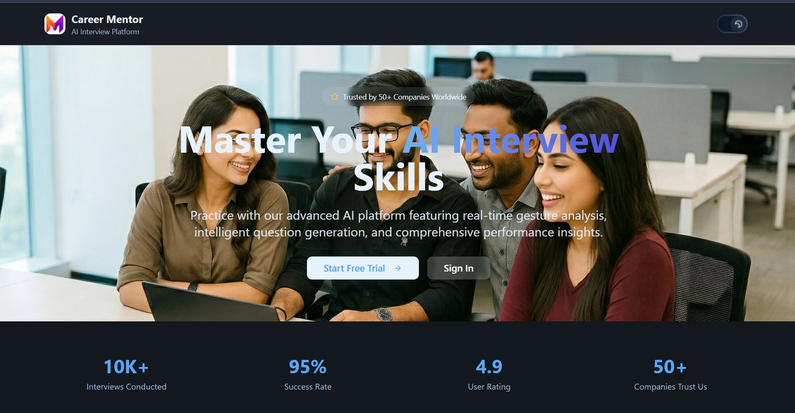 | 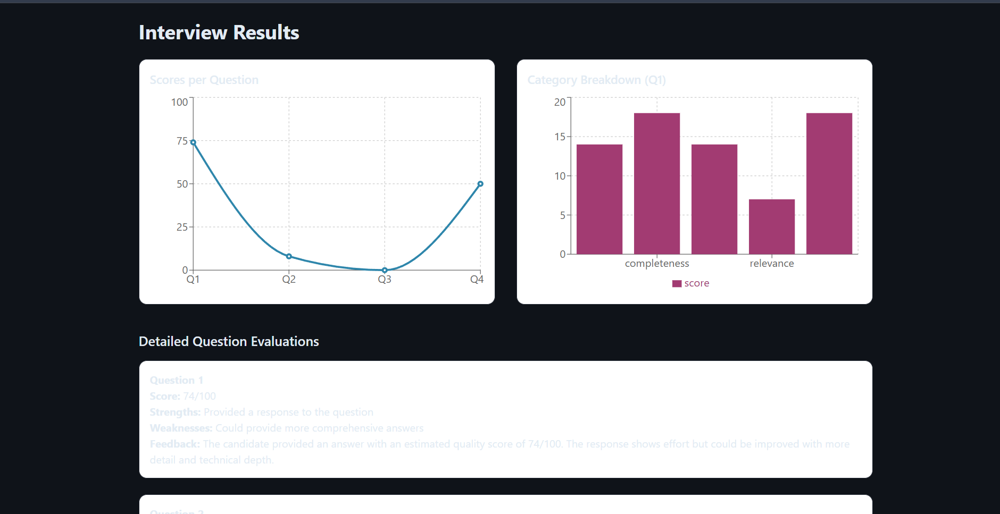 |

</details>

---

## Roadmap

- [ ] Fine-tuned `career-mentor` model trained on reviewed interview data
- [ ] Follow-up questions based on the candidate's previous answer
- [ ] HR and behavioural rounds (STAR-method grading)
- [ ] Role-specific interview tracks (frontend, backend, ML, data)
- [ ] Downloadable progress report across multiple interviews
- [ ] One-click cloud GPU backend

---

## Author

**Shrish Das**, B.Tech CSE (AI & ML), VIT Bhopal University

[](https://shrishcraft.vercel.app)
[](https://github.com/Shrishkd)

Feedback, issues and pull requests are welcome. If Career Mentor helped you prepare, a ⭐ on the repo is appreciated.

---

## License

This project is licensed under the **MIT License**. You're free to use, modify and build on it.
